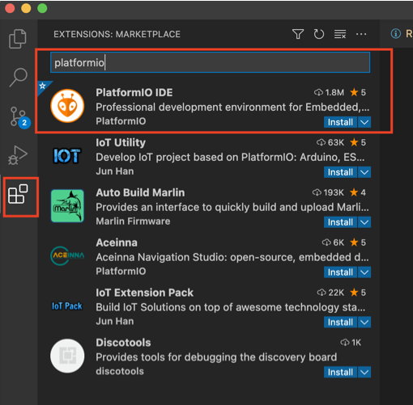
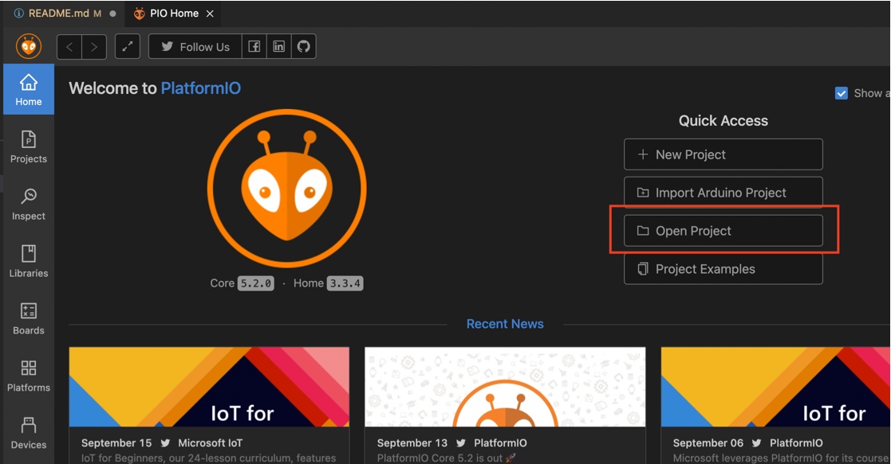
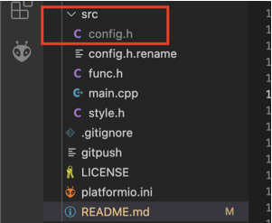
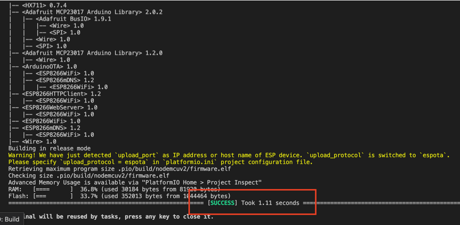
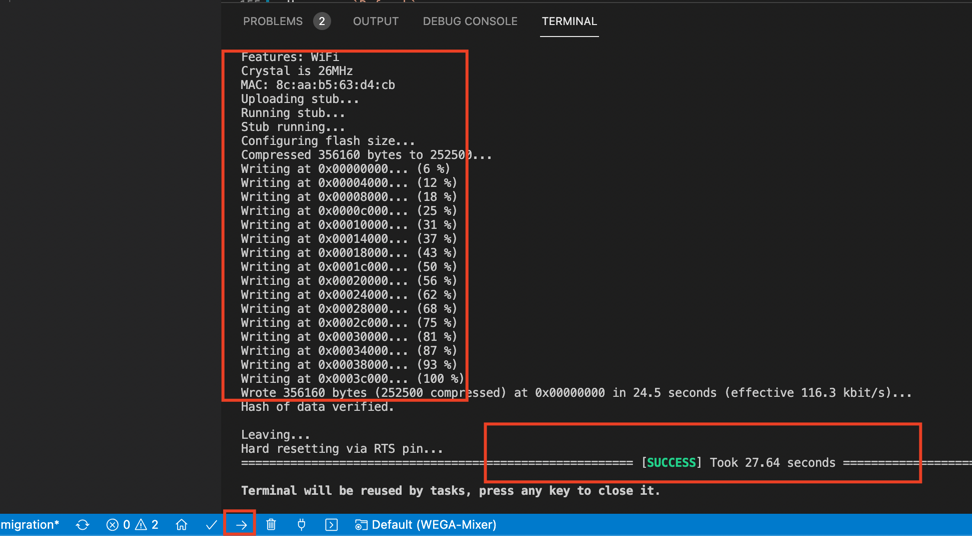

# WEGA-Mixer

**WEGA-Mixer** - это устройство для автоматизированного изготовления двухкомпонентных комплексных удобрений в жидком виде путем точного смешивания их составляющих.

**WEGA-Mixer** автономное самостоятельное устройство на базе `ESP8266` с управлением через веб интерфейс со встроенными весами и группой насосов (помп).


Целью данного миксера, является автоматизированное изготовление порций удобрений с индивидуальной рецептурой рассчитаных на изготовление необходимого количества (объема) рабочего раствора. Разовая порция удобрений от нескольких капель, на 1 и менее литра, до 1 кг, чего достаточого для приготовления 100-200 литров.

**WEGA-Mixer** является отличным/важным дополнением к [WEGA-HPG](https://github.com/WEGA-project/WEGA-HPG) калькулятору из которого можно дозировать(печатать) раствор на прямую.

Так же **WEGA-Mixer** является важным звеном в [WEGA ecosystem](images/wega-ecosystem.jpg)

Содержание 
=================
<!--ts-->
* [Минимальные требования и знания](#what_to_know)
* [Что потребуется купить(ардуино, драйвера, АЦП ...)](#what_to_buy)
* [Законченные варианты миксеров](#completed-mixers)
* [Скачать проект WEGA-Mixer](#mixer)
* [Подключение по схеме компонентов для миксера](#connections)
  * [Важно](#important-connections)
* [Установка Visual Studio Code (vscode) и прошивка](#install)
* [Калибровка весов/стола](#scale-calibration)
  * [Полу-автоматическая калибровка](#auto-calibration)
  * [Ручная калибровка](#manual-calibration)
* [Важно](#important)
* [Где искать помощь](#help)

<!--te-->

---
<a name="what_to_know"></a>

### Минимальные требования и знания

Для того, чтобы собрать этот миксер необходимо:

- Минимальные знания в электронике (знать что такое `+` или `GND`)
- Умение читать схему, да-да, именно читать, а не разглядывать и смотреть
- Знание, что такое паяльник и как с ним работать
- Понимание как соединить три проводка в одной точке
- Умение собирать компоненты по схеме
- Знать и уметь, как прошивать ардуину и вообще знать, что это такое
- Минимальные знания в программировании. Мы попытались минимизировать необходимость ковыряние в коде, но все же придется изменять некоторые значения, о которых речь пойдет ниже

Если, всего выше перечисленного или одного из выше перечисленного не знаешь, не умеешь, не понимаешь, найди человека, который соберет этот миксер за тебя.

---
<a name="what_to_buy"></a>

### Что потребуется купить(ардуино, драйвера, АЦП ...)

Предположим, что у вас есть желание собрать миксер, и вы обладаете, минимальными требованиями и знаниями для того, что бы все это собрать, спаять, залить и настроить. Отлично.
Значит уже самое время закупить все необходимые компоненты.

Ниже я приведу список, того, что покупалось лично мной и из чего собрал миксер лично я. Вы вправе подобрать аналоги, которые могут отличаться, а может быть и нет, в связи с этим нет никаких гарантий, что у вас будет все работать.

Для данного миксера потребуются:
- Насосы перистальтические на 12 вольт. [Такие](https://www.aliexpress.com/item/4000602374795.html) или [такие](https://aliexpress.ru/item/4000045793568.html) как минимум 6, но лучше 8шт. Диаметр шлангов лучше всего 2Х4мм
- [Модули L293D](https://aliexpress.ru/item/32987988286.html?&sku_id=66805515258) управления насосами (по одному на 2 насоса с реверсом) 3 или 4 соответственно
- 16 канальный [MCP23017 расширитель GPIO](https://aliexpress.ru/item/32840741707.html?&sku_id=65081375969)
- [ESP8266](https://aliexpress.ru/item/32809158270.html?&sku_id=10000000428582330)
- [LCD Экран I2C 1602](https://aliexpress.ru/item/1738714643.html?&sku_id=12000017422590841) с модулем на i2c
- [АЦП датчика веса HX711](https://aliexpress.ru/item/32462156464.html?&sku_id=10000001648810250) с дополнительным экранированием (это важно именно такой)
- [Тензодатчик на 1 кг](https://aliexpress.ru/item/4000078618409.html?&sku_id=10000000205070447)


----
<a name="completed-mixers"></a>

### Законченные варианты миксеров
[Здесь](images/completed-mixers) можно посмотреть варианты корпусов для миксера и законченные работы.

В целом каждый делает то, что работает и подходит именно для него. Для кого-то основной момент это минимализм и стремление сделать его как можно меньше, для кого-то это максимальная вместимость монорастворов. Каждый выбирает сам, что важно и подходит для него.

---
<a name="mixer"></a>

### Скачать проект WEGA-Mixer
Скачать проект можно несколькими путями, самый просто это скачать архив текущего [репозитория](https://github.com/WEGA-project/WEGA-Mixer/archive/refs/heads/main.zip) или со страницы релизов. Последний стабильный релиз можно найти [здесь](https://github.com/WEGA-project/WEGA-Mixer/releases).

Важно!!! Релизы ниже `v2.2.0` предназначены для сбора прошивки под `Arduino IDE` и не работают с `vscode` и `platformio`.

Нажимаем на `Source code(zip)` выбранного релиза, скачиваем. Распаковываем архив в удобное место на диске.

Важно, что бы в путях до проекта не было пробелов и русских названий.

Например так будет работать `D:\WEGA-Mixer-2.1.5`

Так не будет работать `D:\Вега проект\WEGA-Mixer-2.1.5`

---
<a name="connections"></a>

### Подключение по схеме компонентов для миксера
Здесь можно видеть текущую схему подключения.

<a href="images/connection_diagramm.png"></a>

Здесь находится [диаграмма](scheme).

<a name="important-connections"></a>

#### Важно
* Для питания миксера необходим блок питания на 12 вольт и минимум 1А.

* Питание экрана и других компонентов происходит от первого, верхнего по схеме, драйвера, на который в данном случае и подключается/подается 12 вольт. Никакого дополнительного питания больше не требуется.

* USB провод нельзя использовать для питания схемы, это всего лишь консольный кабель, который используется только для прошивки ESP


-------
<a name="install"></a>

### Установка Visual Studio Code (vscode) и прошивка
#### Шаг 1
Скачать и установить [vscode](https://code.visualstudio.com/download).

#### Шаг 2
Запускаем `vscode`  идем в `extensions` и устанавливаем `platformio`.

<a href="images/pio-ext.png"></a>

#### Шаг 3

Открываем папку с проектом.

<a href="images/pio-open-project.png"></a>

#### Шаг 4
Копируем файл `src/config.h.rename` вставляем в ту же папку и переименовываем новый файл в `config.h`.

<a href="images/pio-config.png"></a>

Открываем  `config.h`.

- Обновляем `ssid` - имя вашей сети 
- Обновляем `password` - пароль для вашего WiFi

```bash
const char* ssid = "YOUR_WIFI_NETWORK_NAME";
const char* password = "YOUR_WIFI_PASSWORD";
```

- Обновляем имена насосов, если это требуется. Если вы собирали точно по схеме, то скорее всего ничего обновлять не нужно.
- Пример имен насосов в коде `// Port 1`:

```bash
// Pump #1
#define pump1  A0        // Port 1
#define pump1r B0        // Port 2
#define pump1n "1:Ca"    // Display name
#define pump1p 4000      // Preload (ms)
```
- Сохраняем код
- Нажимаем `build`, что бы проверить что прошивка собирается

<a href="images/pio-build.png"></a>

Если все хорошо, то в терминале будет что-то подобное.

<a href="images/pio-build-success.png"></a>

Если в терминале видим `SUCCESS` то подключаем `ESP8266` через консольный кабель.

<a name="usb"></a>

Нажимаем кнопку  `Upload` и заливаем проект на `ESP8266`

<a href="images/pio-upload.png"></a>

В большинстве случаев `platformio` найдет подключеное устроиство через консольный кабель автоматически.

При условии, что сборка компонентов была выполнена правильно, то как только прошивка будет загружена на плату и произойдет перезагрузка, на экране должна появится надпись `Ready`.

<a href="images/screen_ready.png"></a>

<a name="ota"></a>

#### Прошивка по Wi-Fi
В дальнейшем, если будет желание или необходимость перепрошивки `ESP` это можно будет сделать через Wi-Fi.

Для этого нужно будет раскоментировать строчку в `platformio.ini` и указать свой `IP` адрес миксера, адрес можно видеть каждый раз на экране миксера при включении.


---
<a name="scale-calibration"></a>
### Калибровка весов/стола

<a name="auto-calibration"></a>
#### Полу-автоматическая калибровка

Мы постарались, минимизировать ручной труд и время потраченное для калибровки весов.

Что потребуется:
- Весы с точностью 0.01
- Что-то, что имеет постоянный вес в районе 500г(стакан, гиря, и так далее)
- Листок бумаги и карандаш
- Взвешиваем ваш вес и записываем это значение, для большей точности, можно взвесить раз 5 и найти средний вес. Допустим этот вес получился 500г

Для того, что бы выполнить полу-автоматическую калибровку необходимо запустить миксер и зайти по `IP` адресу на страницу миксера, о том, как найти `IP` адрес, уже было описано ранее в разделе [Прошивка по Wi-Fi(через WiFi)](#ota).

Открываем веб страницу миксера и нажимаем `Calibrate scales`

<a href="images/calibrate_scales_web.png"></a>

Для калибровки точки А потребуется сделать следующие действия:
- Копируем значение из поля `Current RAW` и вставляем в поле `RAW on Zero` и нажимаем `Submit`
- Ставим на весы, наш заранее подготовленный вес на точку А(точка/поле, где будет стоять стакан для раствора А) и нажимаем `Submit`
- Копируем значение из поля `Current RAW` и вставляем в поле `RAW value with load`, заполняем поле `Value with load (gramm)` значением, которое получи при взвешивании нашего веса на весах(как мы уже договорились этот вес 500г) и нажимаем `Submit`
- После нажатия кнопки `Submit` мы получим коэфициент `scale_calibration`, который нужно записать в файл `src/config.h` в поле `scale_calibration_A`

<a href="images/scale_calibration_mark.png"></a>

Теперь, все то же самое проделываем для точки B

Как только вы получили значение `scale_calibration` записываем его в файл `src/config.h` в поле `scale_calibration_B`, сохраняем файл и заливаем прошивку

<a name="manual-calibration"></a>
#### Ручная калибровка

1. Нужно взять точно известный вес в районе 500 грамм
2. Отметить две точки на которых будут стоять бутылки(стаканы) А и B
3. Перезагрузить систему с пустым столом.
4. Поставить на точку А известный вес и подбирать значение `scale_calibration_A`

Если вес ниже эталлонного то значение `scale_calibration_A` уменьшаем

Например:

- scale_calibration_A = 2045
- эталлоный вес 470.90
- ставим его на весы(стол) и если значение ниже эталонного
- вес на столе 470.50
- scale_calibration_A уменьшаем
- scale_calibration_A = 2040.35
- прошиваем
- повторяем процедуру
- ставим эталлоный вес на весы(стол) и если значение ниже эталонного
- вес на столе 470.64
- scale_calibration_A уменьшаем
- scale_calibration_A = 2040.25

Записываем полученное значение на листок бумаги или запоминаем, что-то вроде `scale_calibration_A = 2040.25`

Теперь проделываем ту же саму процедуру для точки Б.

- Ставим известный вес на точку Б
- scale_calibration_A = 2045
- эталлоный вес 470.90
- ставим его на весы(стол) и если значение ниже эталонного
- вес на столе 470.50
- scale_calibration_A уменьшаем
- scale_calibration_A = 2040.35
- прошиваем
- повторяем процедуру


Записываем полученное значение на листок бумаги или запоминаем, что-то вроде `scale_calibration_B = 2043.65` Т.е. теперь мы получили коэффициент для точки Б

Теперь открываем файл `src/config.h` и изменяем значения на полученные.

```bash
// scale_calibration, side A and B
float scale_calibration_A = 2040.35;
float scale_calibration_B = 2043.65;
```

Теперь стол откалиброван.

Заливаем прошивку как описано здесь [Прошивка по Wi-Fi](#ota) или через [консоль](#usb) 

---
<a name="important"></a>
### Важно

Есть несколько ньюансов, которые необходио учитывать.

1. Если вы планируете часто делать(печатать) растворы на объем до 10 литров, то стоит изменить концентрацию ваших монорастворов таким образом, что бы значения в поле гр.жидкости были больше 1.5 грамм.
Это позволит делать растворы гораздо быстрее.
Почему так? потому что в логике миксера заложенно по капельное дозирование, если вес желаемой дозы удобрений меньше 1.5 грамм.

<a href="images/small_portions.png"></a>

---
<a name="help"></a>
### Где искать помощь

Если у вас все еще есть вопросы по настройке, заливке и гонфигурированни этого дозера/миксера, 
то их всегда можно задать в официальном телеграмм канале [WEGA-Mixer](https://t.me/joinchat/A44FpRjsKccBaBKLWnp1fw)

**!!! ВАЖНО !!!**

Ответы на вопросы, а что такое плюс или GND, а как быть с проводами и так далее в телеграмм канале дававться не будут.

Смотри [Минимальные требования и знания](#what_to_know)
