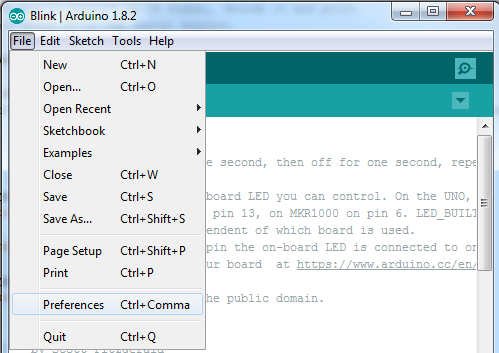
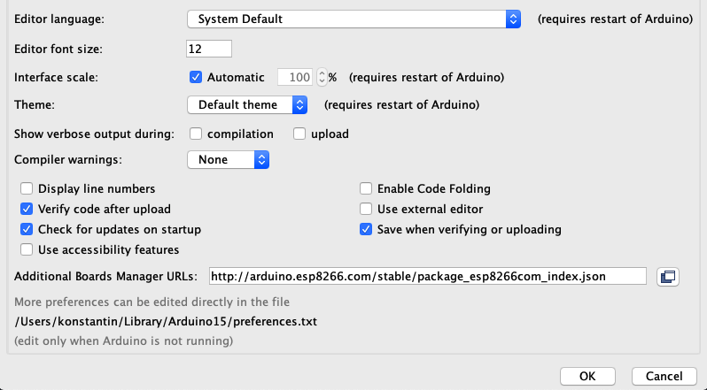
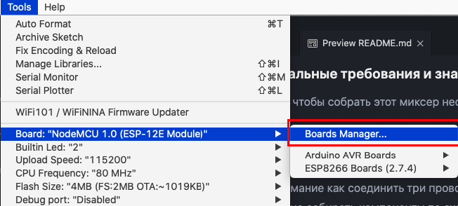
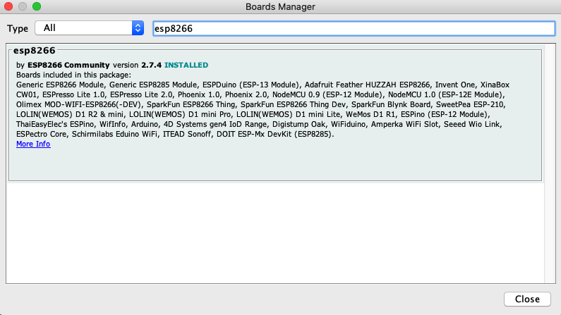
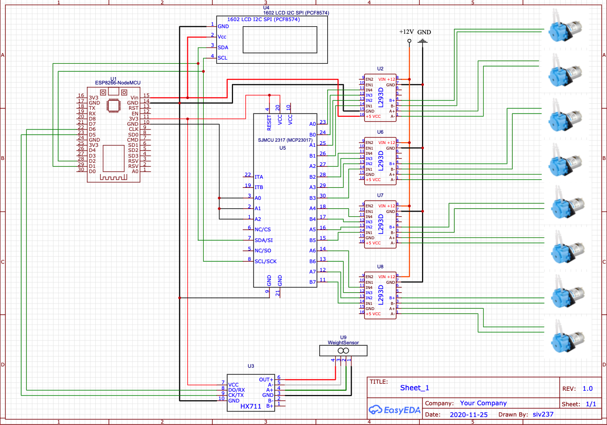
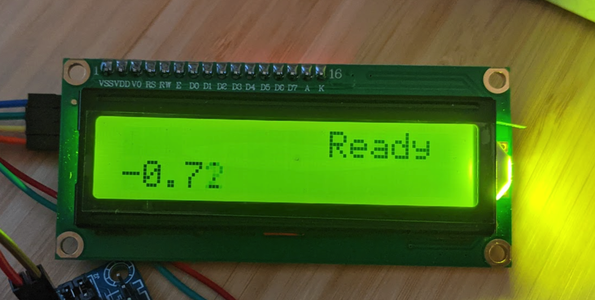
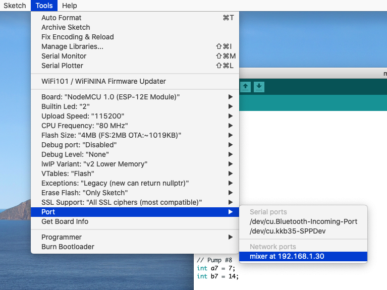
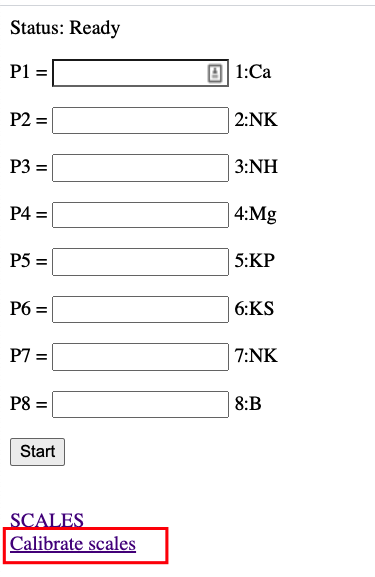
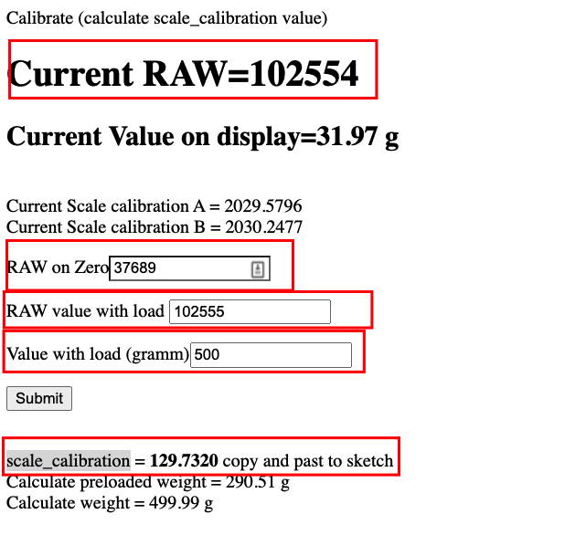
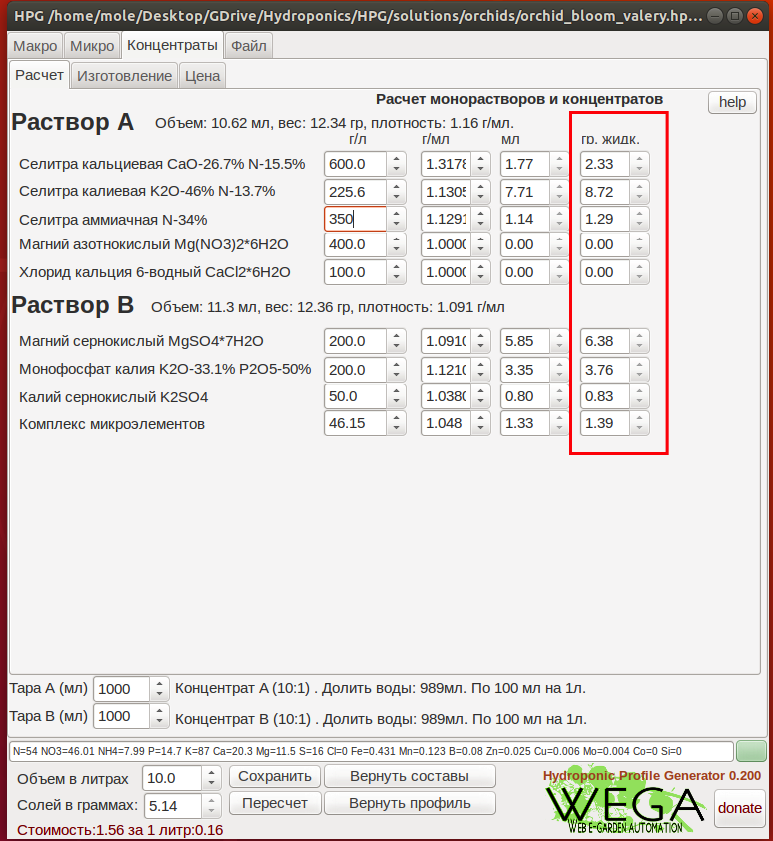

# WEGA-Mixer

WEGA-Mixer - это устройство для автоматизированного изготовления двухкомпонентных комплексных удобрений в жидком виде путем точного смешивания их составляющих.

WEGA-Mixer автономное самостоятельное устройство на базе ESP8266 с управлением через веб интерфейс со встроенными весами и группой насосов (помп).


Целью данного миксера, является автоматизированное изготовление порций удобрений с индивидуальной рецептурой рассчитаных на изготовление необходимого количества (объема) рабочего раствора. Разовая порция удобрений от нескольких капель, на 1 и менее литра, до 1 кг, чего достаточого для приготовления 100-200 литров.

**WEGA-Mixer** является отличным/важным дополнением к [HPG](https://github.com/siv237/HPG) калькулятору из которого можно дозировать(печатать) раствор на прямую.

Так же **WEGA-Mixer** является важным звеном в [WEGA ecosystem](images/wega-ecosystem.jpg)

Содержание
=================
<!--ts-->
* [Минимальные требования и знания](#what_to_know)
* [Что потребуется купить(ардуино, драйвера, АЦП ...)](#what_to_buy)
* [Установка софта](#install)
  * [Arduino IDE](#arduino)
  * [Additional Boards Manager URLs](#boards_manager)
  * [Установка платы ESP8266](#esp_board_install)
  * [Visual Studio Code configuration](#vscode)
  * [Проверка правильности выбранных настроек](#config-check)
  * [Проверка ESP и простой веб сервера](#esp-check)
* [Подключение по схеме компонентов для миксера](#connections)
* [Mixer](#mixer)
  * [Заливка кода/скетча по воздуху(через WiFi)](#ota)
* [Калибровка весов/стола](#scale-calibration)
  * [Полу-автоматическая калибровка](#auto-calibration)
  * [Ручная калибровка](#manual-calibration)
* [Важно](#important)
* [Где искать помощь](#help)

<!--te-->
<a name="what_to_know"></a>
### Минимальные требования и знания

Для того, чтобы собрать этот миксер необходимо:

- Минимальные знания в электронике (знать что такое `+` или `GND`)
- Умение читать схему, да-да, именно читать, а не разглядывать и смотреть
- Знание, что такое паяльник и как с ним работать
- Понимание как соединить три проводка в одной точке
- Умение собирать компоненты по схеме
- Знать и уметь, как прошивать ардуину и вообще знать, что это такое
- Минимальные знания в программировании. Мы попытались минимизировать необходимость ковыряние в коде, но все же придется изменять некоторые значения, о которых речь пойдет ниже

Если, всего выше перечисленного или одного из выше перечисленного не знаешь, не умеешь, не понимаешь, найди человека, который соберет этот миксер за тебя.


<a name="what_to_buy"></a>
### Что потребуется купить(ардуино, драйвера, АЦП ...)

Предположим, что у вас есть желание собрать миксер, и вы обладаете, минимальными требованиями и знаниями для того, что бы все это собрать, спаять, залить и настроить. Отлично.
Значит уже самое время закупить все необходимые компоненты.

Ниже я приведу список, того, что покупалось лично мной и из чего собрал миксер лично я. Вы вправе подобрать аналоги, которые могут отличаться, а может быть и нет, в связи с этим нет никаких гарантий, что у вас будет все работать.

Для данного миксера потребуются:
- Насосы перистальтические. [Такие](https://www.aliexpress.com/item/4000602374795.html) или [такие](https://aliexpress.ru/item/4000045793568.html) как минимум 6, но лучше 8шт
- [Модули L293D](https://aliexpress.ru/item/32987988286.html?&sku_id=66805515258) управления насосами (по одному на 2 насоса с реверсом) 3 или 4 соответственно
- 16 канальный [MCP23S17 расширитель GPIO](https://aliexpress.ru/item/32840741707.html?&sku_id=65081375969)
- [ESP8266](https://aliexpress.ru/item/32809158270.html?&sku_id=10000000428582330)
- [LCD Экран I2C 1602](https://aliexpress.ru/item/1738714643.html?&sku_id=12000017422590841) с модулем на i2c
- [АЦП датчика веса HX711](https://aliexpress.ru/item/32462156464.html?&sku_id=10000001648810250) с дополнительным экранированием (это важно именно такой)
- [Тензодатчик на 1 кг](https://aliexpress.ru/item/4000078618409.html?&sku_id=10000000205070447)

<a name="install"></a>
### Установка софта(Install software)

<a name="arduino"></a>
#### Arduino IDE
[Install Arduino IDE](https://www.arduino.cc/en/software)

Запускаем Arduino IDE, прописываем путь к `Additional Boards Manager URLs` для нашей ESP, устанавливаем нашу плату(board)

<a name="boards_manager"></a>
**Additional Boards Manager URLs**

File -> Preferences

<a href="images/prefs.png"></a>

Вставляем ссылку на конфиг и нажимаем OK.

`http://arduino.esp8266.com/stable/package_esp8266com_index.json`

<a href="images/esp_json.png"></a>

<a name="esp_board_install"></a>
**Установка платы ESP8266**

Tools -> Board -> Board managers

<a href="images/select_esp_board.png"></a>

Ищем `ESP8266` и нажимаем `intstall`

<a href="images/esp_install.png"></a>

<a name="libraries_install"></a>

Изначальное конфигурирование Arduino IDE закончено


Вы можете пропустить следующий шаг если вы собираетесь использовать vscode как основной IDE

Выбираем правильную плату ESP

Tools -> boards manager -> ESP8266 -> NodeMCU 1.0(ESP-12E)

<a name="vscode"></a>
#### Visual Studio Code configuration
<details>
<p>

Если вы планируете использовать vscode как основную IDE для работы с файлами ардуины вам потребуется установить [arduino plugin](https://marketplace.visualstudio.com/items?itemName=vsciot-vscode.vscode-arduino) и сконфигурировать его для работы с вашей платой.

[Здесь видео пример как это сделать](https://www.youtube.com/watch?v=FnEvJXpxxNM)
</p>
</details>

<a name="config-check"></a>
#### Проверка правильности выбранных настроек
Будем считать, что вы уже сконфигурировали вашу IDE для работы с платой. Теперь попробуем загрузить простой пример, маргание светодиодом.

File -> examples -> basics -> blink
Нажать upload/загрузить

Как только процесс загрузки закончится вы должны увидеть как светодиод маргает на вашей ESP

<a name="esp-check"></a>
#### Проверка ESP и простой веб сервера
- Открыть файл `web-ota-example` 
- Изменить значения в файле на ваши
```bash
const char* ssid = "YOUR_WIFI_NETWORK_NAME";
const char* password = "YOUR_WIFI_PASSWORD";
```

- Теперь можно заливать код на вашу плату
- Нажать upload/загрузить

Как только процесс загрузки закончится веб сервер должен быть запущен, теперь необходимо найти IP, который получила плата.
Это можно сделать на странице конфигурации вашего роутера.
Рекомендуется прописать резервацию для этого IP, в этом случае каждый раз ваша плата будет получать один и тот же адрес.

<a name="connections"></a>
### Подключение по схеме компонентов для миксера
Здесь можно видеть текущую схему подключения

<a href="images/connection_diagramm.png"></a>

Здесь находится [диаграмма](scheme)

<a name="mixer"></a>
### Mixer
Последняя версия [миксера](mixer)

- Открываем файл прошивки из папки `mixer/mixer.ino`
- Обновляем `ssid` - имя вашей сети и `password` - пароль для вашего WiFi.

```bash
const char* ssid = "YOUR_WIFI_NETWORK_NAME";
const char* password = "YOUR_WIFI_PASSWORD";
```

- Обновляем имена насосов, если это требуется. Если вы собирали точто по схеме, то скорее всего ничего обновлять не нужно.
- Пример имен насосов в коде `// Port 1`:

```bash
// Pump #1
#define pump1  A0        // Port 1
#define pump1r B0        // Port 2
#define pump1n "1:Ca"    // Display name
#define pump1p 4000      // Preload (ms)
```

- Сохраняем код
- Нажимаем upload/загрузить

Как только код будет загружен на плату и произойдет перезагрузка, на экране должна появится надпись `Ready`

<a href="images/screen_ready.png"></a>

Ну все, код залит, экран работает.

<a name="ota"></a>
### Заливка кода/скетча по воздуху(через WiFi)
В примере вышел мы с вами прошили ардуину через консольный порт по средством физического подключения USB к вашему компьютеру. После первой заливки кода/скетча миксера появляется возможность заливать обновленный код, если это необходимо по воздуху(через WiFi). Для того, что бы это сделать нужно включить ваш миксер и дождаться загрузки. После этого в Arduino IDE 
будет доступен новый порт. Выглядеть это будет примерно вот так

<a href="images/ota.png"></a>

Теперь все, что нужно это поменять порт и можно будет обновлять уже через WiFi.
Более детальный пример конфигурирования OTA можно посмотреть [здесь](https://voltiq.ru/esp8266-ota-updates-with-arduino-ide/) (этот пример не относится к данному проекту)


<a name="scale-calibration"></a>
### Калибровка весов/стола

<a name="auto-calibration"></a>
#### Полу-автоматическая калибровка

Мы постарались, минимизировать ручной труд и время потраченное для калибровки весов.

Что потребуется:
- Весы с точностью 0.01
- Что-то, что имеет постоянный вес в районе 500г(стакан, гиря, и так далее)
- Листок бумаги и карандаш
- Взвешиваем ваш вес и записываем это значение, для большей точности, можно взвесить раз 5 и найти средний вес. Допустим этот вес получился 500г

Для того, что бы выполнить полу-автоматическую калибровку необходимо запустить миксер и зайти по IP адресу на страницу миксера, о том, как найти IP адрес, уже было описано ранее в разделе [Заливка кода/скетча по воздуху(через WiFi)](#ota)
Открываем веб страницу миксера и нажимаем `Calibrate scales`

<a href="images/calibrate_scales_web.png"></a>

Для калибровки точки А потребуется сделать следующие действия:
- Копируем значение из поля `Current RAW` и вставляем в поле `RAW on Zero` и нажимаем `Submit`
- Ставим на весы, наш заранее подготовленный вес на точку А(точка/поле, где будет стоять стакан для раствора А) и нажимаем `Submit`
- Копируем значение из поля `Current RAW` и вставляем в поле `RAW value with load`, заполняем поле `Value with load (gramm)` значением, которое получи при взвешивании нашего веса на весах(как мы уже договорились этот вес 500г) и нажимаем `Submit`
- После нажатия кнопки `Submit` мы получим коэфициент `scale_calibration`, который нужно записать в файл `mixer.ino` в поле `scale_calibration_A`

<a href="images/scale_calibration_mark.png"></a>

Теперь, все то же самое проделываем для точки B

Как только вы получили значение `scale_calibration` записываем его в файл `mixer.ino` в поле `scale_calibration_B`, сохраняем файл и заливаем прошивку

<a name="manual-calibration"></a>
#### Ручная калибровка

1. Нужно взять точно известный вес в районе 500 грамм
2. Отметить две точки на которых будут стоять бутылки(стаканы) А и B
3. Перезагрузить систему с пустым столом.
4. Поставить на точку А известный вес и подбирать значение `scale_calibration_A`

Если вес ниже эталлонного то значение `scale_calibration_A` уменьшаем

Например:

- scale_calibration_A = 2045
- эталлоный вес 470.90
- ставим его на весы(стол) и если значение ниже эталонного
- вес на столе 470.50
- scale_calibration_A уменьшаем
- scale_calibration_A = 2040.35
- прошиваем
- повторяем процедуру
- ставим эталлоный вес на весы(стол) и если значение ниже эталонного
- вес на столе 470.64
- scale_calibration_A уменьшаем
- scale_calibration_A = 2040.35

Записываем полученное значение на листок бумаги или запоминаем, что-то вроде `scale_calibration_A = 2040.35`

Теперь проделываем ту же саму процедуру для точки Б.

- Ставим известный вес на точку Б
- scale_calibration_A = 2045
- эталлоный вес 470.90
- ставим его на весы(стол) и если значение ниже эталонного
- вес на столе 470.50
- scale_calibration_A уменьшаем
- scale_calibration_A = 2040.35
- прошиваем
- повторяем процедуру
- ставим эталлоный вес на весы(стол) и если значение ниже эталонного
- вес на столе 470.64
- scale_calibration_A уменьшаем
- scale_calibration_A = 2043.65

Записываем полученное значение на листок бумаги или запоминаем, что-то вроде `scale_calibration_B = 2043.65` Т.е. теперь мы получили коэффициент для точки Б

Теперь открываем файл `mixer.ino` и изменяем значения на полученные.

```bash
// scale_calibration, side A and B
float scale_calibration_A = 2040.35;
float scale_calibration_B = 2043.65;
```

Теперь стол откалиброванн.

Заливаем прошивку.


<a name="important"></a>
### Важно

Есть несколько ньюансов, которые необходио учитывать.

1. Если вы планируете часто делать(печатать) растворы на объем до 10 литров, то стоит изменить концентрацию ваших монорастворов таким образом, что бы значения в поле гр.жидкости были больше 1.5 грамм.
Это позволит делать растворы гораздо быстрее.
Почему так? потому что в логике миксера заложенно по капельное дозирование, если вес желаемой дозы удобрений меньше 1.5 грамм.

<a href="images/small_portions.png"></a>

2. В миксере есть функция предварительной загрузки удобрений в шланги перед основной подачей. Что это значит. Это значит, что миксер включает насос на короткое время, и за счет этого набирает некоторое количество удобрений в трубки, перед основной подачей. В данный момент все значения разные, так как они будут для каждого случая(миксера) свои. От чего это зависит. Это зависит от длины ваших шлангов(трубок), которые идут от емкости с монораствором до насоса. В некоторых случая, шланги короткие, в некоторых длинные 30см и более. Для разных шлангов разное время подготовки(предварительной загрузки) удобрений.
Если вы видите, что предварительная загрузка удобрений избыточна или не достаточна, вам необходимо изменить [вот эти значения](https://github.com/siv237/WEGA-Mixer/blob/main/mixer/mixer.ino#L28) для тех насосов, которые необходимо скорректировать.

Ниже приведен пример, где искать эти значения. Вам нужно изменить значения в поле `// Preload (ms)` на желаемые.

```bash
// Pump #1
#define pump1  A0        // Port 1
#define pump1r B0        // Port 2
#define pump1n "1:Ca"    // Display name
#define pump1p 4000      // Preload (ms)
  ...
```

<a name="help"></a>
### Где искать помощь

Если у вас все еще есть вопросы по настройке, заливке и гонфигурированни этого дозера/миксера, 
то их всегда можно задать в официальном телеграмм канале [Wega-mixer](https://t.me/joinchat/A44FpRjsKccBaBKLWnp1fw)

**!!! ВАЖНО !!!**

Ответы на вопросы, а что такое плюс или GND, а как быть с проводами и так далее в телеграмм канале дававться не будут.

Смотри [Минимальные требования и знания](#what_to_know)
