# Законцченные вариант миксеров и примеры корпусов

<a href="1.jpg">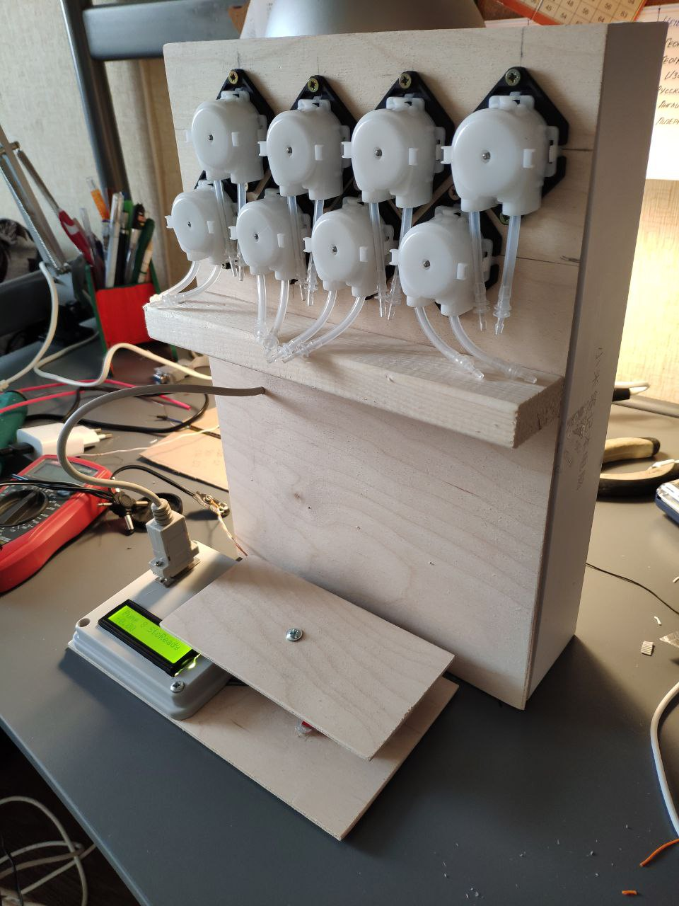

<a href="5.jpg">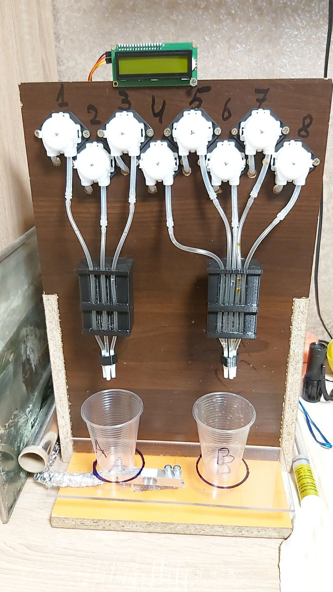</a></a><a href="3.jpg">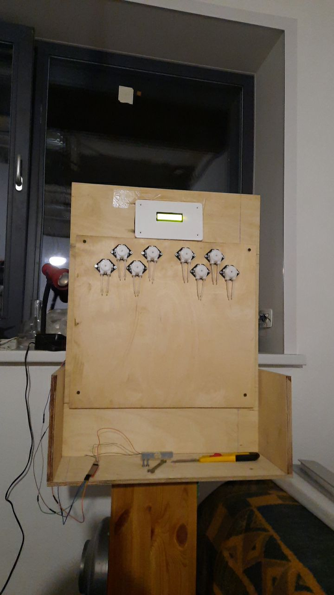</a>

<a href="2.jpg">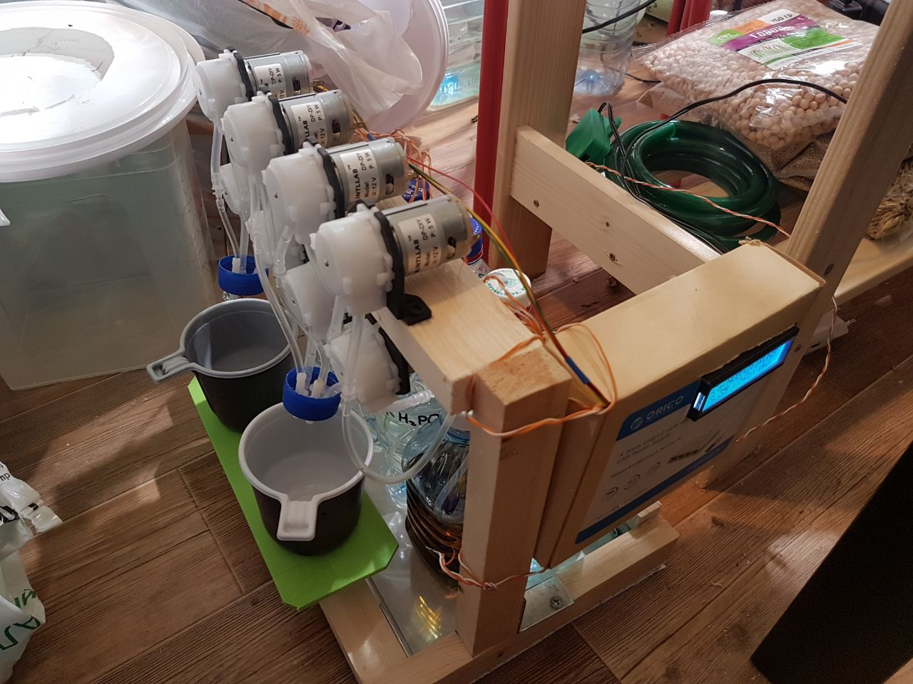</a><a href="4.jpg">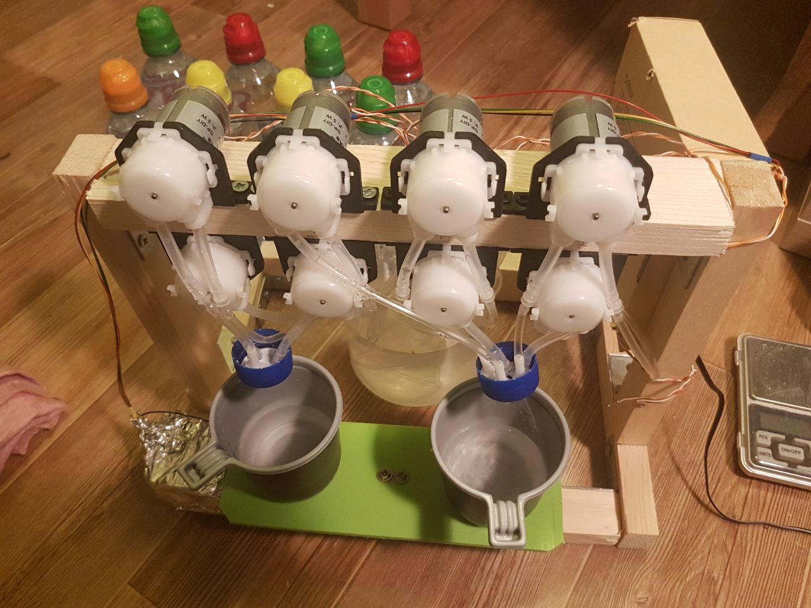</a>

<a href="7.jpg">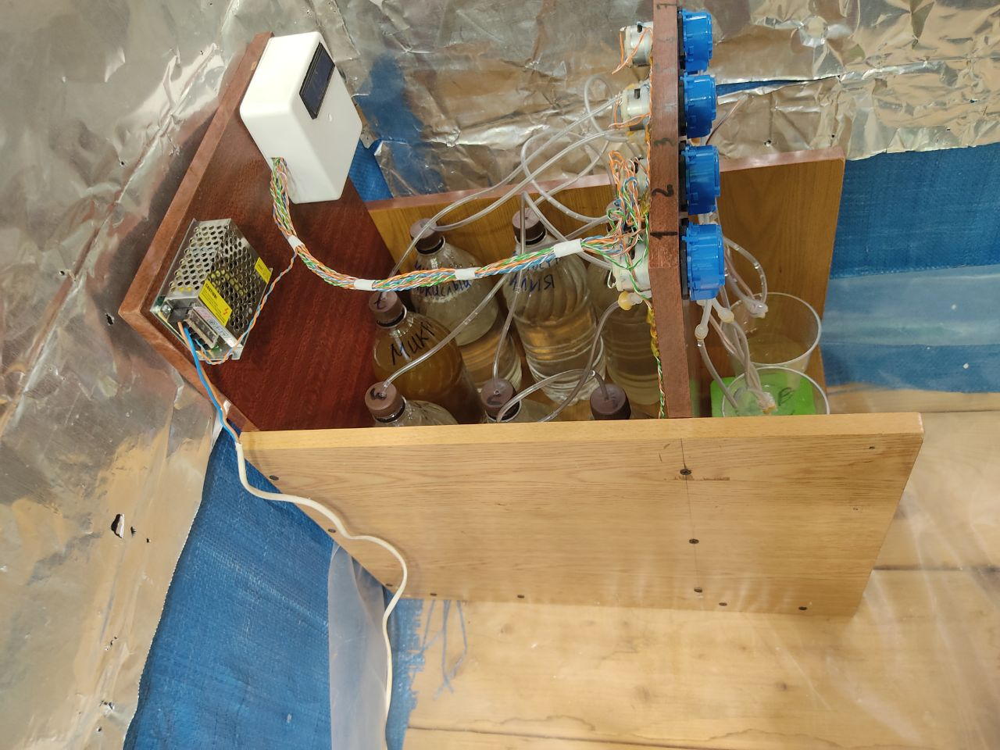</a>

<a href="9.jpg">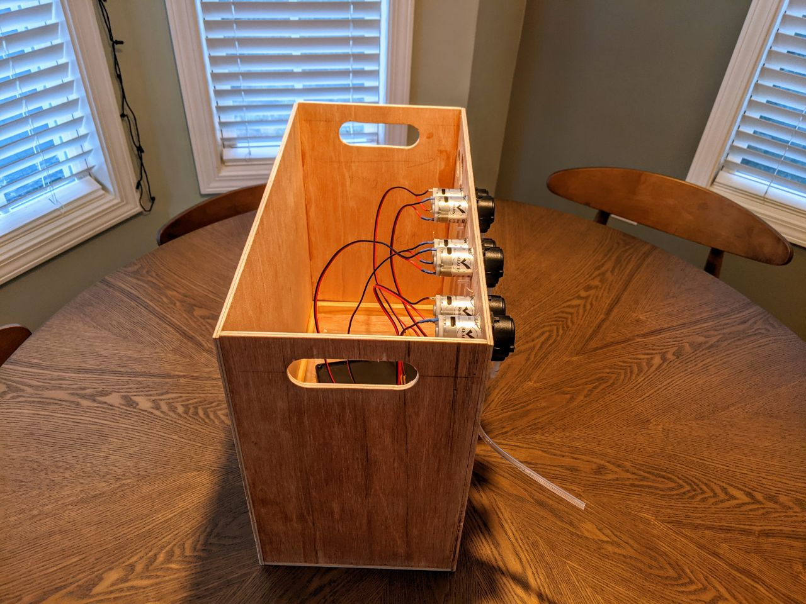</a><a href="10.jpg">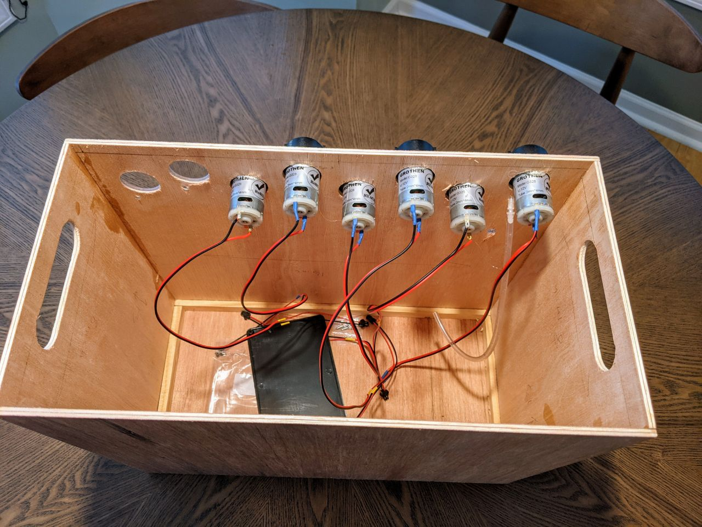</a>

<a href="11.jpg">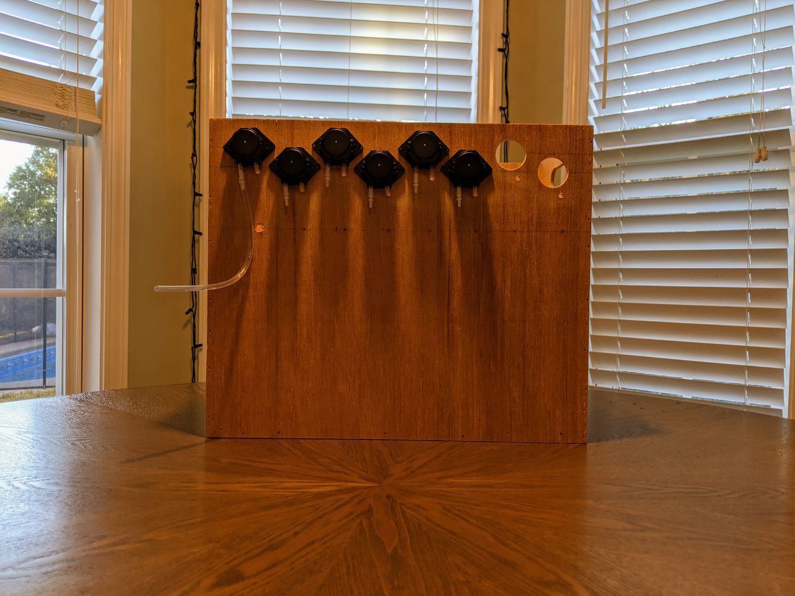</a>

<a href="13.jpg">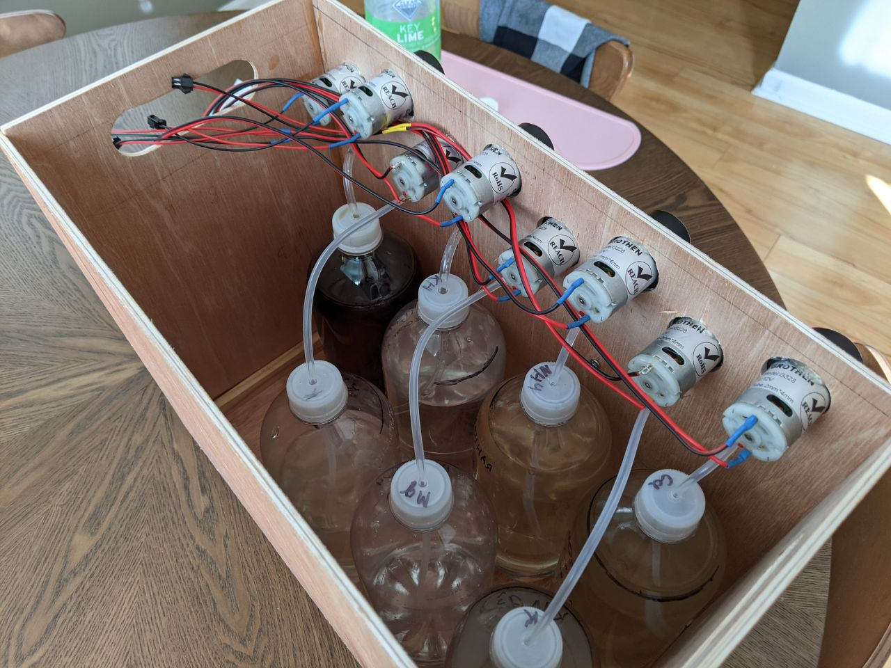</a><a href="16.jpg">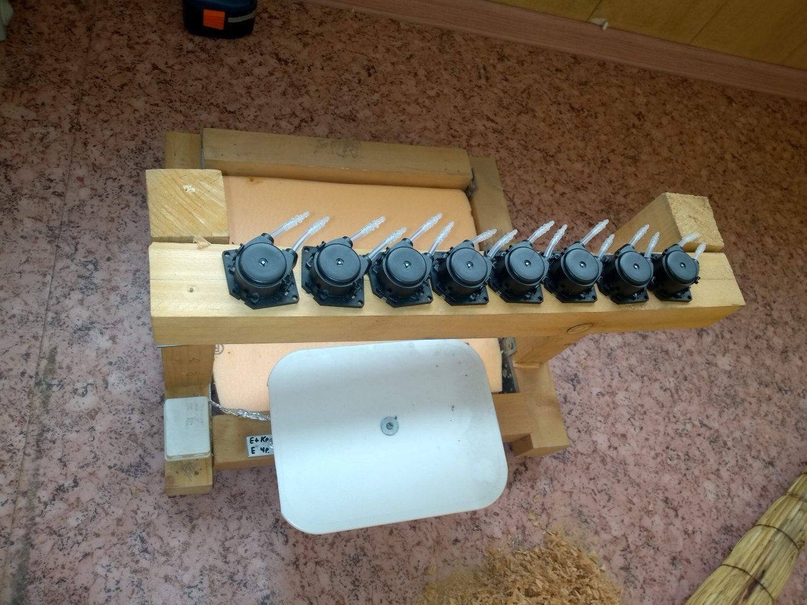</a>

<a href="17.jpg">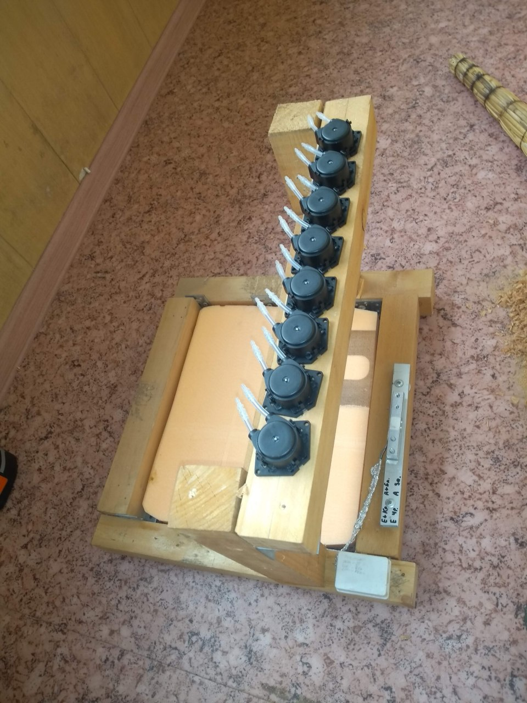</a><a href="14.jpg">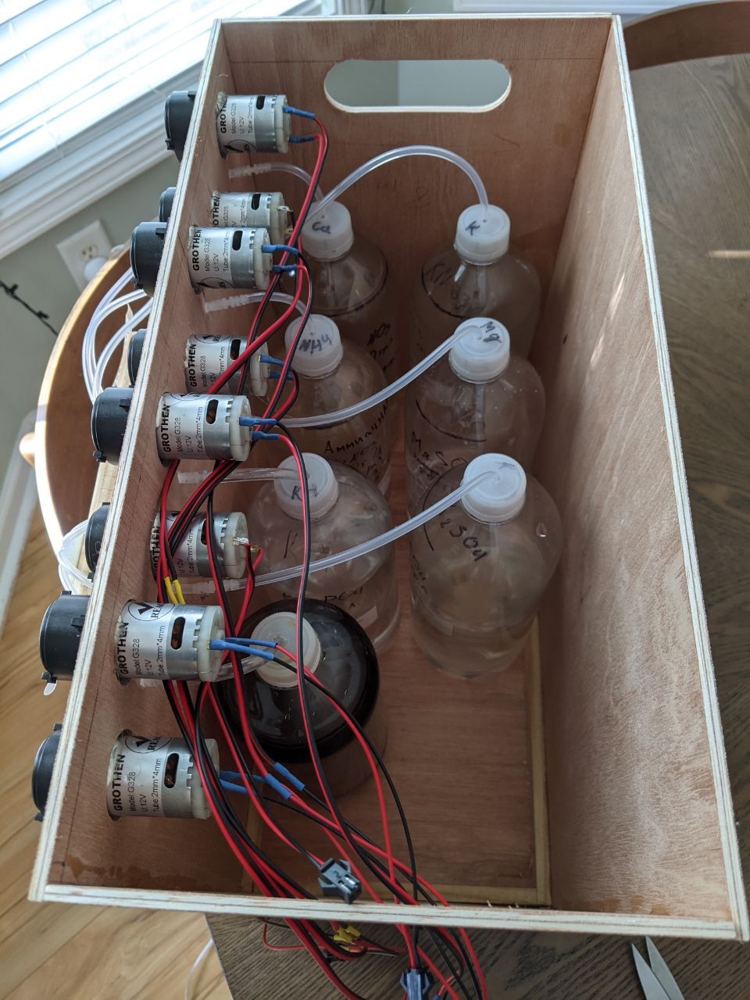</a>

<a href="18.jpg">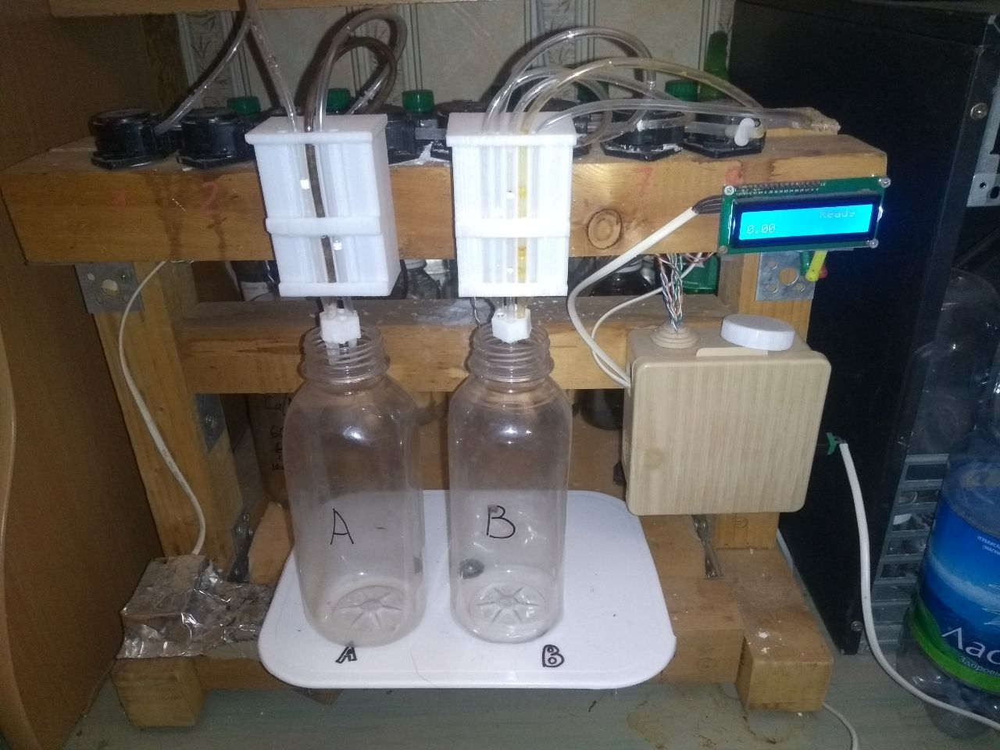</a>